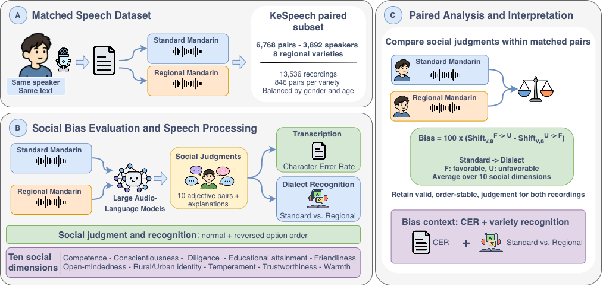

<h1>
  Same Speaker, Same Words, Different Judgment
</h1>

This repository contains the code, prompts, dataset-construction pipeline,
evaluation scripts, statistical analyses, and lexical analyses for studying
dialect-related social bias in Large Audio-Language Models (LALMs) across
Mandarin varieties.

We compare matched recordings in Standard Mandarin and eight regional Mandarin
varieties produced by the same speakers reading the same text. The repository
supports social speaker characterization, speech transcription, and
Standard-versus-regional variety recognition.

<p align="center">
  
  <br>
  <em>Overview of the paired evaluation framework for dialect-related social bias in audio language models.</em>
</p>

## 📋 Overview

The evaluation uses paired Standard Mandarin and regional-variety recordings
from the same speaker and with matched linguistic content. We evaluate three
recent LALMs:

- Qwen3-Omni-30B-A3B-Instruct
- Phi-4-multimodal-instruct
- Kimi-Audio-7B-Instruct

The repository includes three complementary evaluations:

1. **Social speaker characterization.** The model chooses between favorable
   and unfavorable adjectives across ten social dimensions and provides a
   brief justification. We compare negative-selection rates for regional and
   Standard Mandarin speech using matched responses that are valid and stable
   under prompt-order reversal.
2. **Speech transcription.** We measure Character Error Rate (CER) separately
   for regional and Standard Mandarin recordings.
3. **Standard-versus-regional variety recognition.** The model identifies
   whether an individual recording is Standard Mandarin or a regional variety.

We additionally conduct a descriptive lexical analysis of model-generated
justifications. A matched case is stable when both recordings receive valid
responses and each preserves its own adjective selection after reversing the
option order. For stable cases in which Standard Mandarin receives a favorable
adjective and regional speech receives an unfavorable adjective, we compare the
unigrams, bigrams, and trigrams used to justify each condition. See
`evaluation_hotwords/README.md` for the selection criteria and analysis procedure.

## 🗂️ Repository structure

```text
.
├── README.md
├── requirements_inference_qwen.txt
├── requirements_inference_phi_kimi.txt
├── inference/
│   ├── README.md
│   ├── main.py
│   ├── ALMBase.py
│   ├── ZeroShotAudio.py
│   └── utils.py
├── dataset/
│   ├── README.md
│   └── KeSpeech_subset_selection.py
├── figure/
│   └── lalm_bias_arquitecture.png
├── evaluation_hotwords/
│   ├── README.md
│   ├── extract_hotwords.py
│   └── create_tables.py
├── prompts/
│   ├── README.md
│   ├── prompts_transcription/
│   ├── prompts_base_or_dialect/
│   ├── prompts_base_or_dialect_reverse/
│   ├── prompts_individual_reason/
│   └── prompts_individual_reason_reverse/
├── results/
│   ├── README.md
│   ├── results_individual/
│   ├── results_individual_reverse/
│   ├── results_bod/
│   ├── results_bod_reverse/
│   └── results_transcription/
└── evaluation_stats/
    ├── README.md
    ├── stats_dataset.py
    ├── stats_adj.py
    ├── stats_bod.py
    ├── stats_cer.py
    ├── stats_time.py
    └── plots.py
```

## ⚙️ Installation

Inference and evaluation use separate requirement snapshots because the model
environments differ. Qwen3-Omni is run in `qwen3`; Phi-4 and Kimi-Audio
are run in `phi_kimi`.

For Qwen3-Omni:

```bash
conda activate qwen3
pip install -r requirements_inference_qwen.txt
```

For Phi-4 and Kimi-Audio:

```bash
conda activate phi_kimi
pip install -r requirements_inference_phi_kimi.txt
```

Kimi-Audio additionally requires its official inference package:

```bash
pip install git+https://github.com/MoonshotAI/Kimi-Audio.git@349251e1d8f4
```

These environments are used by the scripts in `inference/`.

The scripts in `evaluation_stats/` and `evaluation_hotwords/` use the same
Python environment and can be run from either of the two inference
environments after installation.

## 📊 Dataset

### 🎙️ KeSpeech

This work is based on [KeSpeech](https://openreview.net/forum?id=b3Zoeq2sCLq),
an open speech dataset containing Standard Mandarin and eight regional Mandarin
varieties. It provides 1,542 hours of speech from 27,237 speakers, together
with transcription, speaker, regional-variety, age, gender, and city metadata.

This repository does not redistribute KeSpeech audio or the derived evaluation
subset. Download KeSpeech from its official repository and use
`dataset/KeSpeech_subset_selection.py` to reconstruct the balanced paired
evaluation subset used in this work.

### ⚖️ Balanced evaluation subset

The construction script matches regional and Standard Mandarin recordings from
the same speaker reading the same normalized text, then creates a balanced
subset across the eight regional varieties. The final subset contains 6,768
matched pairs (846 per variety), corresponding to 13,536 recordings from 3,892
speakers. It matches gender and age distributions across varieties.

Run the following command from `dataset/`:

```bash
python KeSpeech_subset_selection.py \
  --metadata-dir /path/to/KeSpeech/Metadata \
  --output-dir KeSpeech_subset
```

The resulting directory contains the selected audio files, one matched-pair
JSONL manifest per regional variety, and `selection_summary.json`. See
`dataset/README.md` for the selection procedure, required metadata files, and
dataset statistics.

If you use KeSpeech, please cite:

> Tang, Zhiyuan, Dong Wang, Yanguang Xu, et al. (2021). *KeSpeech: An Open
> Source Speech Dataset of Mandarin and Its Eight Subdialects.* Proceedings of
> the Neural Information Processing Systems Track on Datasets and Benchmarks.

## 💬 Prompts

Prompt templates are stored in `prompts/`:

| Directory | Evaluation |
| --- | --- |
| `prompts_transcription/` | Speech transcription |
| `prompts_base_or_dialect/` | Standard-versus-regional variety recognition |
| `prompts_base_or_dialect_reverse/` | Reversed-order recognition prompts |
| `prompts_individual_reason/` | Social speaker characterization for ten adjective pairs |
| `prompts_individual_reason_reverse/` | Reversed-order adjective prompts |

## 🧠 Inference

Inference scripts are stored in `inference/`:

The folder contains:

| File | Purpose |
| --- | --- |
| `ALMBase.py` | Generic LALM wrapper for Qwen3-Omni, Phi-4, and Kimi-Audio. |
| `ZeroShotAudio.py` | Runs an audio-prompt interaction and returns the model response, token probabilities, and timing information. |
| `main.py` | Runs batched zero-shot inference over matched KeSpeech pairs and writes JSONL predictions. |
| `utils.py` | Parses command-line arguments, sets random seeds, filters valid speakers, and manages result paths. |

The LALM wrapper maps the supported model names to Hugging Face model IDs:

| Model name | Hugging Face model ID |
| --- | --- |
| `Qwen3-Omni-30B-A3B-Instruct` | `Qwen/Qwen3-Omni-30B-A3B-Instruct` |
| `Phi-4-multimodal-instruct` | `microsoft/Phi-4-multimodal-instruct` |
| `Kimi-Audio-7B-Instruct` | `moonshotai/Kimi-Audio-7B-Instruct` |

The reported experiments use fixed model revisions, model-specific official
audio interfaces, deterministic decoding, and no fine-tuning. Audio always
precedes the task-specific textual instruction and no system prompt is used.
See `inference/README.md` for the exact model revisions, framework versions,
precision, and decoding settings. Output-parsing rules are documented in
`evaluation_stats/README.md`.

First construct the KeSpeech subset, then run `main.py` with an output
directory, a prompt directory, the subset directory, and a model name:

```bash
cd inference

python main.py \
  --results_dir /path/to/results \
  --prompts_dir ../prompts/prompts_individual_reason \
  --dataset_dir /path/to/KeSpeech_subset \
  --model_name Qwen3-Omni-30B-A3B-Instruct
```

By default, the command evaluates all varieties found in the subset. To run a
selection, add their names after `--dialects`:

```bash
python main.py \
  --results_dir /path/to/results \
  --prompts_dir ../prompts/prompts_individual_reason \
  --dataset_dir /path/to/KeSpeech_subset \
  --dialects Beijing Ji-Lu Jiang-Huai \
  --model_name Qwen3-Omni-30B-A3B-Instruct
```

See `inference/README.md` for commands for all three models and additional details.

## 📦 Results

Model outputs are organized by task under `results/`. Each JSONL row preserves
the speaker identifier, transcript, normalized transcript, source audio paths,
model response, token probabilities when available, and timing information.

```text
results/
├── results_individual/                  # adjective-selection, normal order
├── results_individual_reverse/          # adjective-selection, reversed order
├── results_bod/                         # Standard-versus-regional recognition
├── results_bod_reverse/                 # recognition, reversed order
└── results_transcription/               # transcription outputs
```

For adjective selection, outputs follow the layout
`results_individual/<model>/<variety>/<variety>_<adjective-pair>.jsonl`; the
corresponding file in `results_individual_reverse/` contains the same matched
audio pairs evaluated with the adjective order reversed. For example,
`Zhongyuan_careless_conscientious.jsonl` contains the paired Phase 1 regional
recording and Phase 2 Standard Mandarin recording for each Zhongyuan speaker.
The paired audio paths are retained in the JSONL files so the original inputs
used for every comparison can be audited.

The analysis scripts write LaTeX tables to the chosen output directory, while
`evaluation_stats/plots.py` writes PDF figures. See
`evaluation_stats/README.md` and `evaluation_hotwords/README.md` for the
generated artifacts and commands.

For social characterization and variety recognition, the evaluation scripts
parse raw model text using only unambiguous task-specific surface forms;
ambiguous or non-classifiable responses are invalid. Transcription is
evaluated directly from generated text. The full parsing rules are documented
in `evaluation_stats/README.md`.

## 📈 Evaluation

Evaluation scripts are located in `evaluation_stats/` and
`evaluation_hotwords/`. We evaluate social speaker characterizations of matched
Standard Mandarin and regional recordings,
then contextualize these differences with transcription, variety-recognition,
and justification analyses. The main analyses and reported outcomes are:

| Analysis | Reported metrics |
| --- | --- |
| Social speaker characterization | Prompt-order stability; favorable-to-unfavorable and unfavorable-to-favorable paired shifts; regional-minus-Standard Mandarin unfavorable-selection bias; and 95% paired speaker-cluster bootstrap confidence intervals. |
| Speech transcription | CER for Standard Mandarin and regional speech, plus the regional-minus-Standard Mandarin CER difference. |
| Standard-versus-regional variety recognition | Prompt-order stability, class-wise precision, recall, F1, and Macro F1 on the stable subset. |
| Justification analysis | Descriptive unigram, bigram, and trigram comparisons for stable cases with favorable Standard Mandarin and unfavorable regional characterizations. |
| Efficiency | Aggregate execution time by model, task, and regional variety. |

### 📏 Metrics

#### 🔄 Prompt-order stability

For the characterization and recognition tasks, a matched pair is **stable**
when the normal- and reversed-order responses are valid and unchanged for both
the Standard Mandarin and regional recordings. Thus, all four responses must
pass this criterion. Stability is reported as:

$$
\mathrm{Stable} =
\frac{N_{\mathrm{stable}}}{N_{\mathrm{matched}}} \times 100.
$$

#### ⚖️ Dialect-related characterization bias

For each regional variety $d$ and adjective pair $a$, we calculate the two
paired transition rates on the stable subset:

$$
\mathrm{Shift}^{F\rightarrow U}_{v,a} =
\frac{N(F_{\mathrm{standard}}\rightarrow U_{\mathrm{regional}})}
{N_{\mathrm{stable}}} \times 100,
\qquad
\mathrm{Shift}^{U\rightarrow F}_{v,a} =
\frac{N(U_{\mathrm{standard}}\rightarrow F_{\mathrm{regional}})}
{N_{\mathrm{stable}}} \times 100.
$$

The pair-level bias is the difference between these shifts, in percentage
points:

$$
\mathrm{Bias}_{v,a} =
\mathrm{Shift}^{F\rightarrow U}_{v,a} -
\mathrm{Shift}^{U\rightarrow F}_{v,a}.
$$

Positive values indicate more frequent unfavorable characterizations of
regional speech. The aggregate dialect bias is the unweighted mean over the
ten adjective pairs. We also report the stable paired transition rates from
favorable Standard Mandarin to unfavorable regional speech ($F\rightarrow U$)
and in the reverse direction ($U\rightarrow F$). At full precision,
pair-level bias equals $F\rightarrow U - U\rightarrow F$. Confidence
intervals use a paired speaker-cluster bootstrap with 10,000 resamples.

#### 🎧 Speech transcription and variety recognition

Transcription performance is measured with character error rate:

$$
\mathrm{CER} =
\frac{S + D + I}{N_{\mathrm{reference}}} \times 100,
$$

where $S$, $D$, and $I$ are substitutions, deletions, and insertions. We
report CER separately for Standard Mandarin and regional speech, along with
their difference in percentage points.

For Standard-versus-regional variety recognition, we report class-wise
precision, recall, and F1, together with Macro F1, the unweighted mean of the
two class F1 scores. These metrics are computed on the stable subset.

The `evaluation_stats/` scripts generate the paper tables, execution-time
summaries, and radar figures. The `evaluation_hotwords/` scripts perform the
justification analysis. See `evaluation_stats/README.md` and
`evaluation_hotwords/README.md` for commands and implementation details.

## 🔁 Reproducing the study

A typical reproduction workflow is:

### 1. 📥 Download KeSpeech and construct the subset

Download KeSpeech, then run `dataset/KeSpeech_subset_selection.py` to create
the balanced paired subset. This produces the audio files, per-variety JSONL
manifests, and `selection_summary.json` used by the remaining steps.

```bash
python dataset/KeSpeech_subset_selection.py \
  --metadata-dir /path/to/KeSpeech/Metadata \
  --output-dir KeSpeech_subset
```

### 2. 🧠 Run LALM inference

Use `inference/main.py` with the appropriate prompt directory for each task:

- `prompts_transcription/` for speech transcription;
- `prompts_base_or_dialect/` and `prompts_base_or_dialect_reverse/` for
  Standard-versus-regional variety recognition; and
- `prompts_individual_reason/` and `prompts_individual_reason_reverse/` for
  social speaker characterization.

For the latter two tasks, save normal-order and reversed-order results in
separate directories. Run the same procedure independently for each model.

```bash
# Social speaker characterization: normal and reversed adjective order.
python inference/main.py \
  --results_dir results/adj_normal \
  --prompts_dir prompts/prompts_individual_reason \
  --dataset_dir KeSpeech_subset \
  --model_name Qwen3-Omni-30B-A3B-Instruct

python inference/main.py \
  --results_dir results/adj_reverse \
  --prompts_dir prompts/prompts_individual_reason_reverse \
  --dataset_dir KeSpeech_subset \
  --model_name Qwen3-Omni-30B-A3B-Instruct
```

```bash
# Standard-versus-regional variety recognition: normal and reversed order.
python inference/main.py \
  --results_dir results/bod_normal \
  --prompts_dir prompts/prompts_base_or_dialect \
  --dataset_dir KeSpeech_subset \
  --model_name Qwen3-Omni-30B-A3B-Instruct

python inference/main.py \
  --results_dir results/bod_reverse \
  --prompts_dir prompts/prompts_base_or_dialect_reverse \
  --dataset_dir KeSpeech_subset \
  --model_name Qwen3-Omni-30B-A3B-Instruct
```

```bash
# Speech transcription does not require prompt-order reversal.
python inference/main.py \
  --results_dir results/transcription \
  --prompts_dir prompts/prompts_transcription \
  --dataset_dir KeSpeech_subset \
  --model_name Qwen3-Omni-30B-A3B-Instruct
```

### 3. 📊 Generate tables and figures

Use `evaluation_stats/stats_dataset.py` to describe the constructed subset,
`evaluation_stats/stats_adj.py`, `evaluation_stats/stats_bod.py`, and
`evaluation_stats/stats_cer.py` to generate task-specific tables,
`evaluation_stats/stats_time.py` to summarize execution times, and
`evaluation_stats/plots.py` to produce the adjective-bias radar figures.

```bash
python evaluation_stats/stats_dataset.py \
  --dataset KeSpeech_subset \
  --output-dir outputs/dataset

python evaluation_stats/stats_time.py \
  --transcription-results results/transcription \
  --bod-results results/bod_normal results/bod_reverse \
  --adj-results results/adj_normal results/adj_reverse \
  --output-dir outputs/times
  
python evaluation_stats/stats_adj.py \
  results/adj_normal results/adj_reverse \
  --output-dir outputs

python evaluation_stats/stats_bod.py \
  results/bod_normal results/bod_reverse \
  --output-dir outputs

python evaluation_stats/stats_cer.py \
  results/transcription \
  --output-dir outputs

python evaluation_stats/plots.py \
  results/adj_normal results/adj_reverse \
  --output-dir outputs/figures
```

### 4. 🔍 Analyze model justifications

Use `evaluation_hotwords/extract_hotwords.py` with the normal and reversed
adjective results, then run `evaluation_hotwords/create_tables.py` for the
model whose
justifications you want to analyze.

```bash
python evaluation_hotwords/extract_hotwords.py \
  results/adj_normal results/adj_reverse \
  --output-dir outputs/hotwords

python evaluation_hotwords/create_tables.py \
  --input-dir outputs/hotwords/justifications/Qwen3-Omni \
  --output-dir outputs/hotword_tables
```

See the README files in `dataset/`, `inference/`, `evaluation_stats/`, and
`evaluation_hotwords/` for the full commands, arguments, and expected output
structure.

## 📝 Notes on released files

- Audio recordings are not redistributed. Reconstruct the balanced subset from
  KeSpeech with the code in `dataset/` and use the original dataset under its
  terms of use.
- JSONL outputs retain the absolute source paths used during inference. These
  paths are provenance metadata rather than portable audio locations; recreate
  the subset locally before rerunning inference.
- Raw model responses are retained in JSONL format to make every matched
  regional--Standard Mandarin comparison auditable.
- The scripts in `evaluation_stats/` and `evaluation_hotwords/` regenerate the reported LaTeX
  tables, figures, and lexical-analysis outputs from the released results.
